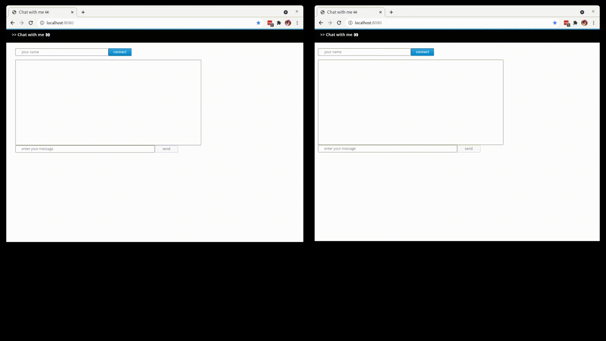

## Quarkus Chat with Me Server



Allows `users` to chat to `support` people.

To become a support user, `connect` using `support<anything>`. Everyone else is a user. Try with multiple browser tabs. For now, only 1 `support` person is allocated per `user`. 

Stores messages in Kafka that are streamed to Materialized database views in real-time.

### Run locally

Kafka, Materialize
```bash
podman-compose up -d
```

Chat Server
```bash
mvn quarkus:dev
```

Connect to `http://localhost:8080/` using multiple browser tabs.

### Kappa architecture for data

Uses Kafka as the message store. Materialize as the streaming realtime database.

Raw chat data
```bash
kafkacat -b localhost:9092 -t chats -o beginning -C -f '\nKey (%K bytes): %k
  Value (%S bytes): %s
  Timestamp: %T
  Partition: %p
  Offset: %o
  Headers: %h'
```

Realtime Materialized database
```bash
psql -h localhost -p 6875 -U materialize materialize -f ./load.sql
psql -h localhost -p 6875 -U materialize materialize -c 'select * from CHAT_ALL;'
psql -h localhost -p 6875 -U materialize materialize -c 'select * from CHAT_TOTALS;'

watch -c "psql -h localhost -p 6875 -U materialize materialize -c 'select * from CHAT_ALL order by timestamp desc;'"
```

e.g.
```bash
     key     |         timestamp          | username | supportname |        	                 message
-------------+----------------------------+----------+-------------+-----------------------------------------------------------------
 bob-support | 2021-11-19 06:24:36.317+00 | bob      | support     | User bob left
 bob-support | 2021-11-19 06:24:34.595+00 | bob      | support     | >> bob: ah, right ! that worked thanks. see ya !
 bob-support | 2021-11-19 06:24:21.352+00 | bob      | support     | >> support: well, its easy .. you just goto here http://help-me
 bob-support | 2021-11-19 06:24:06.389+00 | bob      | support     | >> bob: err .. how do i do that ?
 bob-support | 2021-11-19 06:23:58.809+00 | bob      | support     | >> support: oh, thats sounds bad .. can you check online ?
 bob-support | 2021-11-19 06:23:36.52+00  | bob      | support     | >> bob: i have lost my app?
 bob-support | 2021-11-19 06:23:18.044+00 | bob      | support     | >> support: hi bob, how can i help ?
 bob-support | 2021-11-19 06:23:07.32+00  | bob      | support     | >> bob: hi
(8 rows)
```

### Deploy to OpenShift

```bash
# create local image
mvn clean package -Pnative -Dquarkus.native.container-runtime=podman -Dquarkus.native.container-build=true -Dquarkus.native.builder-image=quay.io/quarkus/ubi-quarkus-mandrel:21.3.0.0-Final-java17
podman build . -t chat
# push image to openshift
oc new-project chat
export HOST=$(oc get route default-route -n openshift-image-registry --template='{{ .spec.host }}')
podman login -u $(oc whoami) -p $(oc whoami -t) $HOST
podman tag localhost/chat:latest ${HOST}/$(oc project -q)/chat:latest
podman push ${HOST}/$(oc project -q)/chat:latest
# run the app
oc new-app chat
oc expose svc/chat
oc patch route/chat --type=json -p '[{"op":"add", "path":"/spec/tls", "value":{"termination":"edge","insecureEdgeTerminationPolicy":"Redirect"}}]'
```
